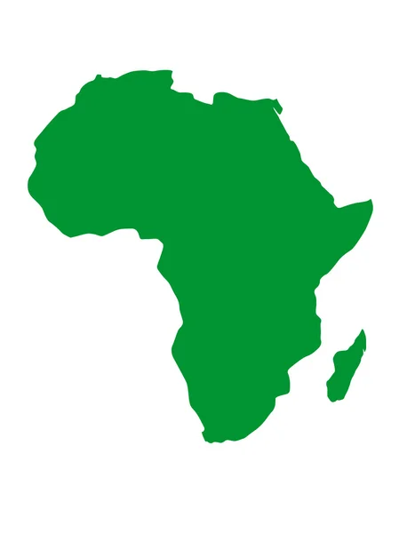

```{r setup, include=FALSE}
library(flexdashboard)
library(highcharter)
library(markdown)
library(leaflet)
library(plotly)
library(shiny)

options(shiny.maxRequestSize=300*1024^2)
```

```{r}
source('cd.R',echo=FALSE)
```


Wold Cocoa {data-orientation=columns}
=====================================

Sidebar {.sidebar}
------------------

```{r}
div(style = "font-size: 18px; font-weight: bold",
    selectInput(
      "prod", "year of production", unique(pays$Year),
       multiple = FALSE
      )
  )
```


```{r}
div(style = "font-size: 18px; font-weight: bold",
    sliderInput("nb", label = "Number of contrie:",
                min = 1, max = 64, value = 10, step = 1
                )
    )
```


```{r}
div(style = "font-size: 18px; font-weight: bold",
    selectInput("Cont", "type of country", unique(Contrie),
                multiple = FALSE
                )
    )
```

```{r picture, echo = F, out.width = '100%'}

```

```{r }
cat("Produced by:","Sy Consulting",sep="\n")
cat("Source of data:","https://www.fao.org/faostat/fr/#home",sep="\n")
```


Column {data-width=650}
-----------------------

### Production by continent from 1960-2021

```{r}
ggplotly(
  ggplot(Africas)+
    geom_line(aes(x=Year,y=Production,colour="Africa"),size=1)+
    geom_line(data=Americas,aes(x=Year,y=Production,colour="America"),size=1)+
    geom_line(data=Asias,aes(x=Year,y=Production,colour="Asia"),size=1)+
    theme_ipsum()+
    scale_color_manual(name="Continent",
                       values=c("Africa"="darkred",
                                "America"="steelblue",
                                "Asia"="#1EE611"))+
    labs(caption = "Source: Our World in Data", size=8)
)

```

### `r renderText({input$Cont})` from 1961-2020

```{r}
renderHighchart({
  dta%>%
    filter(Entity==input$Cont)%>%
    hchart("line",hcaes(x=Year,y=Production),
           name="Production")
  })
```


Column {data-width=350 }
-------------------------------------

### 

```{r}
renderValueBox({
  valueBox(dta%>%
             filter(Entity=="World", Year==input$prod)%>%
             select(Production),
           caption = div(style = "font-size: 28px; font-family: Times New Roman, serif;font-weight: bold",
                         tags$p(paste(input$prod,"world production in tons"))),
           icon = "fa-globe")
})
```

### The share of the world's largest producer (`r renderText ({input$prod})`)

```{r}
renderGauge({
  Wd<-dta%>%
    filter(Entity=="World", Year==input$prod)%>%
    select(Production)
  
  Py<-pays%>%
    filter(Year==input$prod)%>%
    arrange(desc(Production))%>%
    slice(1)%>%
    select(Production)
  
  gauge(
    round((Py/Wd)*100,2)[[1]], min = 0, max = 100, symbol = '%', 
    sectors = gaugeSectors(
      danger = c(0, 20),
      warning = c(20, 80),
      success = c(80, 100)
    )
  )
})
```

### The `r renderText ({input$nb})` best producers of `r renderText ({input$prod})`

```{r}
renderHighchart({
  pays%>%
    arrange(desc(Production))%>%
    filter(Year == input$prod)%>%
    slice(1:input$nb)%>%
    hchart("lollipop",hcaes(x=Entity, y=Production), name = "Production")%>%
    hc_chart(inverted=T)%>%
    hc_xAxis(title = list(text = ""),
             style = list(fontSize = "25px",
                          fontWeight = "bold"),
             labels = list(style = list(fontSize = "1.5vh"))) %>%
    hc_yAxis(title = list(text = "Production",
                          style = list(fontSize = "14px",
                                       fontWeight = "bold")))
  })
```


Africa Cocoa {data-orientation=rows}
=====================================

Sidebar {.sidebar}
-------------------------------------
```{r , echo = F, out.width = '100%'}

```

```{r}
div(style = "font-size: 18px; font-weight: bold",
    selectInput("Af_Z","Zone Africa",unique(Dta_Afr$Zone)
                )
    )
div(style = "font-size: 18px; font-weight: bold",
    selectInput("Af_Y","Production year",unique(pays$Year)
                )
    )
```

```{r , echo = F, out.width = '100%'}

```

```{r }
cat("Produced by:","Sy Consulting",sep="\n")
cat("Source of data:","https://www.fao.org/faostat/fr/#home",sep="\n")
```


Value Boxes {data-width=200}
-------------------------------------

### 

```{r}
renderValueBox({
  valueBox(dta%>%
             filter(Entity=="World", Year==input$Af_Y)%>%
             select(Production),
           caption = div(style = "font-size: 20px; font-family: Times New Roman, serif; font-weight: bold",
             tags$p(paste(input$Af_Y,"world\n production in tons"))), 
           color = "info",
           icon = "fa-globe")
})
```

###  

```{r}
renderValueBox({
  data<-Africas%>%
    filter(Year==input$Af_Y)%>%
    select(Production)%>%                
    slice(1)
  
  valueBox(data,
           caption = div(style = "font-size: 20px; font-family: Times New Roman, serif; font-weight: bold",
             tags$p(paste("African\n production in",input$Af_Y,"in tons"))),
           icon = "fa-globe-africa", 
           color = "success")
  })
```

###  

```{r}
renderValueBox({
  p<-Africas%>%
    filter(if(as.numeric(input$Af_Y)-1>1961){Year==as.numeric(input$Af_Y)-1} else Year==1961)%>%
    select(Production)%>%
    slice(1)
    
  p2<-Africas%>%
    filter(if(input$Af_Y>1961){Year==input$Af_Y} else Year==1961)%>%
    select(Production)%>%
    slice(1)
  
  valueBox(scales::percent(round(((p2[[1]]-p[[1]])/p[[1]]),2)),
           caption = div(style = "font-size: 20px; font-family: Times New Roman, serif; font-weight: bold",
             tags$p(paste("Growth rate, Africa Zone, Year",input$Af_Y))), 
           icon = "fa-line-chart",col="orange")
  })
```

### Africa's share in world production (`r renderText({input$Af_Y})`)

```{r}
renderGauge({
  Wd<-dta%>%
    filter(Entity=="World", Year==input$Af_Y)%>%
    select(Production)
  
  Py<-Africas%>%
    filter(Year==input$Af_Y)%>%
    arrange(desc(Production))%>%
    slice(1)%>%
    select(Production)
  
  gauge(
    round((Py/Wd)*100,2)[[1]], min = 0, max = 100, symbol = '%', 
    sectors = gaugeSectors(
      danger = c(0, 20),
      warning = c(20, 80),
      success = c(80, 100)
    )
  )
})
```


row (data-width = 600)
--------------------------

### `r renderText({input$Af_Z})` 

```{r}
renderLeaflet({
  data <- Dta_Afr%>%
    filter(Zone==input$Af_Z)
  
  leaflet(data = data) %>%
    addProviderTiles(providers$Stamen.TonerLite) %>%
    addCircleMarkers(lng = ~Longitude,
                     lat = ~Latitude,
                     options = markerOptions(draggable = TRUE))
  })
```

### African production from 1961-2020

```{r}
Africas%>%
  hchart("line",hcaes(x=Year,y=Production),
         name="Production")
```

### `r renderText({input$Af_Z})` production from 1961-2020

```{r}
renderHighchart({
  dta%>%
    filter(Entity==input$Af_Z)%>%
    hchart("line", hcaes(x = Year, y = Production),
           name="Production")
})
```

row (data-width = 600)
--------------------------

### `r renderText({input$Af_Z})` countries production (`r renderText({input$Af_Y})`)

```{r}
renderHighchart({
  left_join(Dta_Afr%>%
            filter(Zone==input$Af_Z),pays, by="Entity") %>%
  filter(Year==input$Af_Y)%>%
  arrange(desc(Production))%>%
  hchart('bar', 
         hcaes(x = Entity, y = Production),
         color = "orange", borderColor = "black",
         name = "Production")%>%
    hc_xAxis(title = list(text = ""),
             style = list(fontSize = "25px",
                          fontWeight = "bold"),
             labels = list(style = list(fontSize = "1.5vh"))) %>%
    hc_yAxis(title = list(text = "Production",
                          style = list(fontSize = "14px",
                                       fontWeight = "bold"))) 
})
```

### Annual growth rate (African production)

```{r}
dta%>%
  filter(Entity=="Africa")%>%
  mutate(Rate = round(((Production-lag(Production))/lag(Production))*100,2))%>%
  hchart("column",hcaes(x=Year,y=Rate),
         name="rate")%>%
    hc_xAxis(title = list(text = "")) %>%
    hc_yAxis(title = list(text = "")) 
```

### Production by area (`r renderText({input$Af_Y})`)

```{r}
renderHighchart({
  dta%>%
    filter(Entity%in%Af_Zone, Year==input$Af_Y)%>%
    hchart("pie", hcaes(x = Entity, y = Production),
           name = "Production")
})
```


